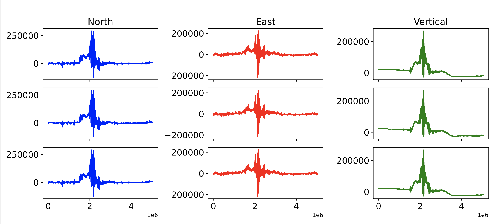
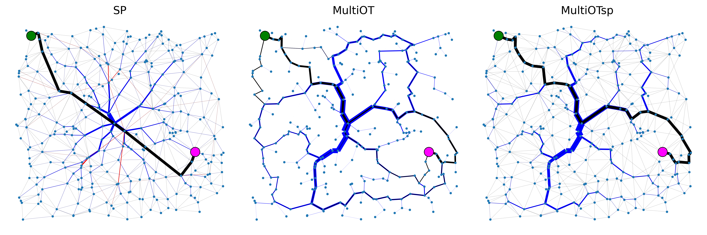
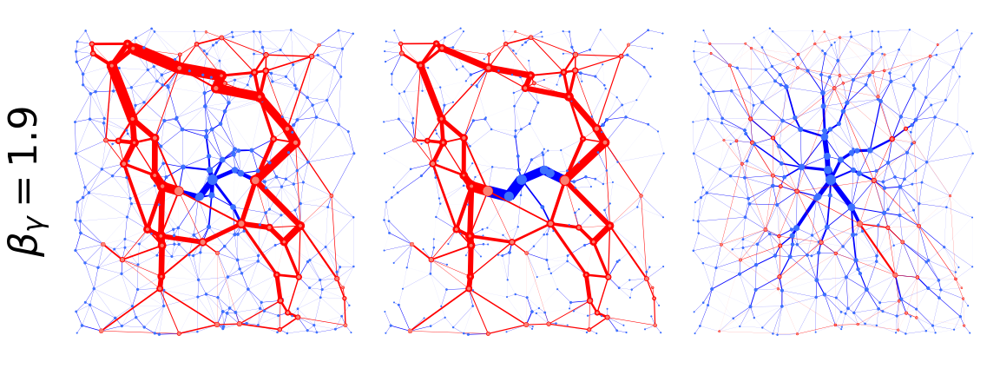

# Hi there, 

I'm Abdul or @aadinoyiibrahim

 - PhD in Computer Science from Max Planck Institute for Intelligent Systems and University of Tübingen, specializing in routing optimization and sustainability
 - Expertise in machine learning, network flow optimization, data science, and algorithm development. Proficient in Python and associated libraries, with skills in visualization, model deployment, and cloud computing
 - Here are three highlighted projects:
    - waveform amplitude prediction

    

     
    

    - Optimal transport in networks
    

     
     
    
